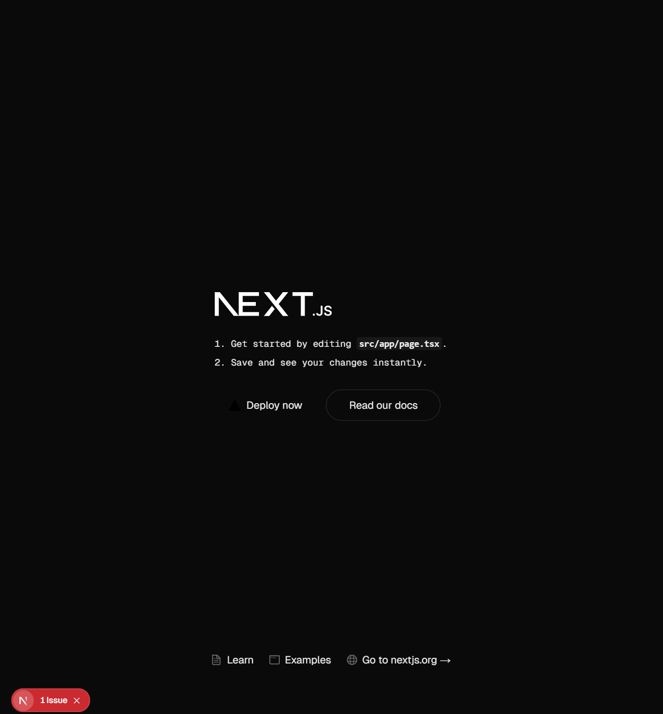
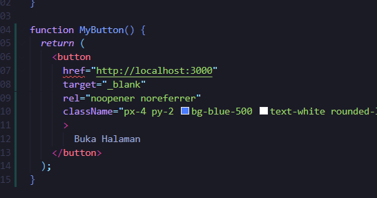

This is a [Next.js](https://nextjs.org) project bootstrapped with [`create-next-app`](https://nextjs.org/docs/app/api-reference/cli/create-next-app).

## Getting Started

First, run the development server:

```bash
npm run dev
# or
yarn dev
# or
pnpm dev
# or
bun dev
```

Open [http://localhost:3000](http://localhost:3000) with your browser to see the result.

You can start editing the page by modifying `app/page.tsx`. The page auto-updates as you edit the file.

This project uses [`next/font`](https://nextjs.org/docs/app/building-your-application/optimizing/fonts) to automatically optimize and load [Geist](https://vercel.com/font), a new font family for Vercel.

## Learn More

To learn more about Next.js, take a look at the following resources:

- [Next.js Documentation](https://nextjs.org/docs) - learn about Next.js features and API.
- [Learn Next.js](https://nextjs.org/learn) - an interactive Next.js tutorial.

You can check out [the Next.js GitHub repository](https://github.com/vercel/next.js) - your feedback and contributions are welcome!

## Deploy on Vercel

The easiest way to deploy your Next.js app is to use the [Vercel Platform](https://vercel.com/new?utm_medium=default-template&filter=next.js&utm_source=create-next-app&utm_campaign=create-next-app-readme) from the creators of Next.js.

Check out our [Next.js deployment documentation](https://nextjs.org/docs/app/building-your-application/deploying) for more details.

## Laporan Praktikum

<table>
    <tr>
        <td></td>
        <td> Pemrograman Berbasis Framework 2024 </td>
    </tr>
    <tr>
        <td>NIM</td>
        <td>2241720201</td>
    </tr>
    <tr>
        <td>Nama</td>
        <td>Raihan Fazzaufa Rasendriya</td>
    </tr>
    <tr>
        <td>Kelas</td>
        <td>TI - 3B</td>
    </tr>
<table>

### Praktikum 1

1. Jelaskan kegunaan masing-masing dari Git, VS Code dan NodeJS yang telah Anda install pada sesi praktikum ini!

Git digunakan untuk melacak perubahan dalam kode sumber selama pengembangan perangkat lunak.

Visual Studio Code digunakan untuk menulis dan mengedit kode yang bisa diintegrasikan dengan Git.

NodeJS digunakan untuk menjalankan JavaScript di luar browser.


Visual Studio Code 
2. Buktikan dengan screenshoot yang menunjukkan bahwa masing-masing tools tersebut telah berhasil terinstall di perangkat Anda!
- Instalasi Git:


- Instalasi Visual Studio Code:


- Instalasi NodeJS:


### Praktikum 2
1. Pada Langkah ke-2, setelah membuat proyek baru menggunakan Next.js, terdapat beberapa istilah yang muncul. Jelaskan istilah tersebut, TypeScript, ESLint, Tailwind CSS, App Router, Import alias, App router, dan Turbopack!

- Typescript adalah bahasa pemrograman yang merupakan superset dari Javascript. Typescript menambahkan fitur tipe statis yang membuat kode lebih aman dan mudah dipelihara.

- ESLint adalah linter untuk JavaScript dan TypeScript yang membantu menemukan dan memperbaiki kesalahan dalam kode dengan menerapkan aturan tertentu.

- Tailwind CSS adalah framework CSS berbasis utility-first, yang memungkinkan pengembang membangun antarmuka dengan cepat menggunakan kelas-kelas utility tanpa perlu menulis banyak kode CSS kustom.

- App Router adalah sistem routing baru di Next.js 13+ yang menggantikan Pages Router. Dengan App Router, Next.js mengadopsi server components secara default, serta memungkinkan penggunaan fitur seperti layout bawaan, streaming, dan server actions.

- Import alias adalah teknik dalam JavaScript/TypeScript yang memungkinkan kita memberikan nama pendek atau alternatif untuk path modul saat mengimpor file atau dependensi.

- Turbopack adalah bundler super cepat untuk aplikasi JavaScript dan TypeScript, dikembangkan oleh Vercel sebagai penerus Webpack. Turbopack dirancang untuk Next.js dan framework modern lainnya, menggunakan Rust untuk kecepatan maksimal.


2. Apa saja kegunaan folder dan file yang ada pada struktur proyek React yang tampil pada gambar pada tahap percobaan ke-3!

- ``public`` berisi file yang tidak diproses oleh Webpack/Bundler.
- ``src`` berisi semua kode react.
    - ``component`` berisi komponen UI yang bisa digunakan ulang.
    - ``pages`` berisi halaman.
    - ``style`` untuk file CSS, Tailwind, atau SASS.
    - ``assets`` untuk gambar, ikon, atau file statis.
- ``App.js`` Merupakan komponen dari aplikasi react. Biasanya, di dalamnya terdapat router, state utama dan tampilan dasar.
- ``index.js`` merupakan file utama yang merender aplikasi React ke dalam index.html.
- ``package.json`` berisi daftar dependencies, script, dan metadata proyek.


3. Buktikan dengan screenshoot yang menunjukkan bahwa tahapan percobaan di atas telah berhasil Anda lakukan!
- Membuat proyek baru:


- Membuka folder baru:


- Running project


- Hasil:



### Praktikum 3
1. Buktikan dengan screenshoot yang menunjukkan bahwa tahapan percobaan di atas telah berhasil Anda lakukan!
- Menambahkan fungsi MyButton:



- Menambah komponen MyButton di samping button Read Our Docs:


- Hasil:


### Praktikum 4
1. Untuk apakah kegunaan sintaks user.imageUrl?

untuk mendapatkan url gambar dari object user yang telah dibuat.

2. Buktikan dengan screenshoot yang menunjukkan bahwa tahapan percobaan di atas telah berhasil Anda lakukan!
- Menambah kode JSX:


- Menambah komponen MyProfile:


- Hasil:


